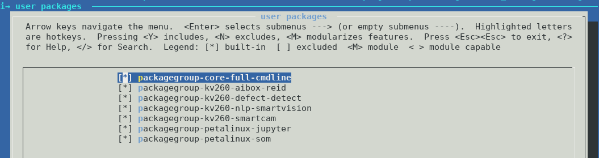

<table class="sphinxhide">
 <tr>
   <td align="center"><h1>AA1: Kria&trade; KV260 Vision AI Starter Kit Tutorial</h1>
   </td>
 </tr>
 <tr>
 <td align="center"><h1>Building Petalinux</h1>

 </td>
 </tr>
</table>

# Building Petalinux


## Introduction

This tutorial walks through the typical steps of creating and customizing a
bootable Linux image for the K26 SOM and the KV260 Vision AI Starter Kit. The Linux
starter image is headless without a Desktop environment. It comes pre-installed
with a minimal set of command line utilites and the jupyter lab IDE which you
can connect to from a web browser. Additional software packages and reference
design applications can be downloaded and installed from a package feed.

In the follwing sections, you will:

1. Build the BSP with the default starter rootfs configuration.
2. Add the Xilinx application packagegroups into the project and configure it
   for the KV260 AI starter kit.
3. Learn how to add your own Vivado or Vitis generated bitstream/xclbin firmware
   components.

### Prerequisites
1. PetaLinux 2021.1 tools installation
	  * Download PetaLinux Tools Installer 2021.1 [PetaLinux Download page](https://www.xilinx.com/support/download/index.html/content/xilinx/en/downloadNav/embedded-design-tools.html)
	  * 2021.1 tools eSDK update 1 [here](#Install-PetaLinux-and-update-the-eSDK)
2. Petalinux SOM StarterKit BSP: xilinx-k26-starterkit-v2021.1-final.bsp
      * Download the Kria K26 Starter Kit 2021.1 Update 1 BSP from the [PetaLinux Download link](https://www.xilinx.com/member/forms/download/xef.html?filename=xilinx-k26-starterkit-v2021.1-final.bsp)

### Install PetaLinux and update the eSDK

To install PetaLinux, extract the petalinux installer, accept the license and source the tool's settings script.

```bash
petalinux-v2021.1-final-installer.run
source settings.sh
```

The eSDK can be used to update the petalinux tool for creating new images or SDKs. The eSDK updates are
published at http://petalinux.xilinx.com/sswreleases/rel-v2021/sdkupdate/2021.1_update1/
Upgrade the tool with new eSDK for '2021.1 update1' release and source the tool's settings script.

```bash
petalinux-upgrade -u 'http://petalinux.xilinx.com/sswreleases/rel-v2021/sdkupdate/2021.1_update1/' -p 'aarch64'
source settings.sh
```

The petalinux tool is now updated with '2021.1 update1' Yocto eSDK. Continue as usual
by creating a new project from a .bsp file. The build will now include the
latest meta-layer and recipe updates.

### Create the Project

Run the following command to create a new Petalinux project from the provided
K26 SOM bsp file:

```
petalinux-create -t project -s xilinx-k26-starterkit-v2021.1-final.bsp
cd xilinx-k26-starterkit-2021.1
```

### Build the Image

Run the below commands to build and package the wic image:

```
petalinux-build
petalinux-package --wic --bootfiles "ramdisk.cpio.gz.u-boot boot.scr Image system.dtb"
```

The generated image file will be located at
`images/linux/petalinux-sdimage.wic`.

**Tip:** The generated wic file assumes a fixed partition size. The total file
         size is 4.1GB but the actual usage on the ext4 partition is much lower.
         The file size can be significantly lower by compressing the file e.g.
         using gzip:

```
gzip images/linux/petalinux-sdimage.wic
```

This generates a new output file named
`images/linux/petalinux-sdimage.wic.gz` with a file size of 265M.

Flash the image on an SD card using Balena Etcher. This image is functionally
equivalent to the prebuilt wic image inside the bsp.

## Enable Xilinx Application Packages

The stock Petalinux BSP is configured for the K26 SOM but it is carrier card and
starter kit agnostic. To include KV260 starter kit specific packages on the
rootfs at build time, the `BOARD_VARIANT` variable needs to be set in the
config. Set the variable with the below command:

```
echo 'BOARD_VARIANT = "kv"' >>  project-spec/meta-user/conf/petalinuxbsp.conf
```

Verify that `BOARD_VARIANT` is now set to the following value in

```
BOARD_VARIANT = "kv"
```

It is now possible to enable packages with a package architecture
set to `k26_kv`.

Next, add the application packagegroups into the user rootfs config file such
that rootfs menuconfig gets populated with those entries.

```
echo 'CONFIG_packagegroup-kv260-smartcam' >> project-spec/meta-user/conf/user-rootfsconfig
echo 'CONFIG_packagegroup-kv260-aibox-reid' >> project-spec/meta-user/conf/user-rootfsconfig
echo 'CONFIG_packagegroup-kv260-defect-detect' >> project-spec/meta-user/conf/user-rootfsconfig
echo 'CONFIG_packagegroup-kv260-nlp-smartvision' >> project-spec/meta-user/conf/user-rootfsconfig
```

Now run the petalinux rootfs config

```
petalinux-config -c rootfs
```

and select `user packages --->` from the menu, then toggle on the newly added
application packagegroups by typing `y` next to those entries. The final
selection should look like this:



Then save and exit the configuration.

Continue with the build and image packaging instructions from above to build
a new image.

## Build the SDK

A cross-compilation SDK is useful for application development on a host machine
for a specific target architecture e.g. X86 host and ARM 64-bit target. Run the
below command to generate a cross-compilation that can be used outside the
PetaLinux:

```
petalinux-build -s
```

The resulting self-extracting shell script installer file is located at
`images/linux/sdk.sh`.

The SDK installer script can be copied to the application developer's host
machine and installed by simply running the script. Follow the prompts on the
screen.

```
$ images/linux/sdk.sh
PetaLinux SDK installer version 2021.1_SOM
============================================
Enter target directory for SDK (default: /opt/petalinux/2021.1_SOM): ./images/linux/sdk
You are about to install the SDK to "/opt/petalinux/xilinx-k26-starterkit-2021.1/images/linux/sdk". Proceed [Y/n]? Y
```

Once the SDK is installed, source the file
`images/linux/sdk/environment-setup-aarch64-xilinx-linux`
to set up the cross-development environment.

## Add New FPGA Firmware

### Create firmware recipe for custom hardware

After you have evaluated the Xilinx provided applications, you may want to
deploy your own custom hardware design. Petalinux provides a helper command to
create a new firmware recipe.

### fpgamanger_custom bbclass

The `fpgamanager_custom` bitbake class is a helper class to generate a set of
FPGA firmware binaries. The following hardware design hand-off artifacts are
required:

1. PL bitstream - applies to Vivado or Vitis designs
2. Device tree overlay source file - the user needs to create this file based on
   on the PL hardware design
3. Xclbin file - only applies to Vitis designs
4. json file - specifies if the overlay is slotted or flat and required by dfx-mgr

Please refer to <https://github.com/Xilinx/kv260-firmware> for example dtsi files
based on the `fpgamanager_custom` class used in the Xilinx accelerated
applications.

The following steps assume you have created a petalinux project and built it. If the project has not been build, run this command to configure the project:

```
petalinux-config --silentconfig 
```

Run the following command to generate a new firmware recipe:

```
petalinux-create -t apps --template fpgamanager -n user-firmware --enable --srcuri "user.bit user.dtsi user.xclbin shell.json"
```

The generated recipe will be located at
`project-spec/meta-user/recipes-apps/user-firmware/user-firmware.bb` with the
following contents:

```
#
## This file is the user-firmware recipe.
#

SUMMARY = "Simple user-firmware to use fpgamanager class"
SECTION = "PETALINUX/apps"
LICENSE = "MIT"
LIC_FILES_CHKSUM = "file://${COMMON_LICENSE_DIR}/MIT;md5=0835ade698e0bcf8506ecda2f7b4f302"

inherit fpgamanager_custom
FPGA_MNGR_RECONFIG_ENABLE = "1"

SRC_URI = "file://user.bit \
           file://user.dtsi \
           file://user.xclbin \
           file://shell.json \
           "

S = "${WORKDIR}"
```

The recipe contains the minimum required elements but can be further customized
by the user for their needs.


### fpgamanger_dtg bbclass

Alternatively, you can use the `fpgamanager_dtg` bitbake class which uses the
Xilinx device tree genrator (dtg) to generate a device tree overlay from a
Vivado or Vitis-generated XSA file. The following hardware design hand-off
artifacts are required:

1. XSA file (must include bitstream) - applies to Vivado or Vitis designs
2. Device tree source file - the user can optionally add a device tree source
   file that will be appended to the dtg-generated device tree file
3. Xclbin file - only applies to Vitis designs
4. json file - specifies if the overlay is slotted or flat and required by dfx-mgr

Run the following command to generate a new firmware recipe:

```
petalinux-create -t apps --template fpgamanager_dtg -n user-firmware --enable --srcuri "user.xsa user.dtsi user.xclbin shell.json"
```

The generated recipe will be located at
`project-spec/meta-user/recipes-apps/user-firmware/user-firmware.bb`


```
#
## This file is the user-firmware recipe.
#

SUMMARY = "Simple user-firmware to use fpgamanager class"
SECTION = "PETALINUX/apps"
LICENSE = "MIT"
LIC_FILES_CHKSUM = "file://${COMMON_LICENSE_DIR}/MIT;md5=0835ade698e0bcf8506ecda2f7b4f302"

inherit fpgamanager_dtg
FPGA_MNGR_RECONFIG_ENABLE = "1"

SRC_URI = "file://user.xsa \
           file://user.dtsi \
           file://user.xclbin \
           file://shell.json \
           "

S = "${WORKDIR}"
```

The recipe contains the minimum required elements but can be further customized
by the user for their needs.


### Firmware Installation Directory

Regardless of whether the `fpgamanger_custom` or `fpgamanger_dtg` bbclass is
used, the resulting output products are installed into the
`/lib/firmware/xilinx/user-firmware` directory on the target rootfs. The output
products are:

1. Bitstream in bin format - this means the bitstream header is stripped
2. Device tree overlay binary (dtbo) compiled from the dtsi file(s)
3. Xclbin - this file is unchanged
4. json file - this file is unchanged 

At run-time, the FPGA firmware can be loaded using the `xmutil loadapp` utility
which is explained in more detail in the getting started guide.

## Next Step

* Setting up the Board and Application Deployment Tutorials
  * [smartcamera](./smartcamera/docs/app_deployment.md)
  * [aibox-reid](./aibox-reid/docs/app_deployment_aib.md)
  * [defect-detect](./defect-detect/docs/app_deployment_dd.md)
  * [nlp-smartvision](./nlp-smartvision/docs/app_deployment_nlp.md)
* Go back to the [KV260 SOM designs start page](../index)

## References

* Petalinux user guide [UG1144](https://www.xilinx.com/support/documentation/sw_manuals/xilinx2021_1/ug1144-petalinux-tools-reference-guide.pdf)

### License

Licensed under the Apache License, Version 2.0 (the "License"); you may not use this file except in compliance with the License.

You may obtain a copy of the License at
[http://www.apache.org/licenses/LICENSE-2.0](http://www.apache.org/licenses/LICENSE-2.0)

Unless required by applicable law or agreed to in writing, software distributed under the License is distributed on an "AS IS" BASIS, WITHOUT WARRANTIES OR CONDITIONS OF ANY KIND, either express or implied. See the License for the specific language governing permissions and limitations under the License.

<p align="center">Copyright&copy; 2021 Xilinx</p>
