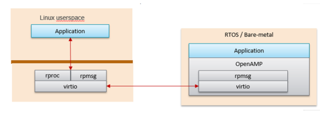

########################################################################################################################
OpenAMP on Kria SOM
########################################################################################################################

.. toctree::
   :maxdepth: 3
   :caption: SOM
   :hidden:

   Landing Page <https://xilinx.github.io/kria-apps-docs/>
   Application Development <https://xilinx.github.io/kria-apps-docs/creating_applications.html>
   Ubuntu Support <https://xilinx.github.io/kria-apps-docs/ubuntu_support.html>
   Boot Firmware <https://xilinx.github.io/kria-apps-docs/bootfw.html>
   Digital Rights Management <https://xilinx.github.io/kria-apps-docs//drm.html>
   Dynamic Function eXchange <https://xilinx.github.io/kria-apps-docs//dfx.html>
   IPMI EEPROM Design Guide <https://xilinx.github.io/kria-apps-docs//ipmi_eeprom.html>
   Kria KV260 <https://xilinx.github.io/kria-apps-docs/kv260-docs.html>
   Kria KR260 <https://xilinx.github.io/kria-apps-docs/kr260-docs.html>
   Kria Robotics Stack <https://xilinx.github.io/KRS/>

Starting from 2022.1, `OpenAMP <https://xilinx-wiki.atlassian.net/wiki/spaces/A/pages/18841718/OpenAMP>`_ is integrated to the Kria SOM pre-built images. OpenAMP is an open-source standard infrastructure for applications to make use of heterogeneous co-processors, and in Kria allows the APU to offload tasks to the MPSoC dual-core RPUs.

The Kria Starter Kit OpenAMP PetaLinux implementation uses the Linux kernel implementation of RPMsg for leveraging the MPSoC RPUs as co-processors. The out-of-box Kria Linux OpenAMP only implements a Linux based master on APU with the RPU as a client processor with corresponding pre-built RPU examples.

********************************************************
RPMsg Implementation
********************************************************

The OpenAMP community supports `two models for RPMsg <https://docs.xilinx.com/r/en-US/ug1186-zynq-openamp-gsg/Components-in-OpenAMP>`_ in a Linux master environment:

1. Linux kernel and RPU remote CPU
   
   * RPMsg using kernel integrated rpmsg and virtio implementations. The Kria implementation does not make use of the libmetal or OpenAMP libraries in the Linux domain.
   * Linux kernel space provides rpmsg and remoteproc, but the RPU application requires Linux to load it in order to talk to the RPMsg counterpart in the Linux kernel.

2. Linux userspace OpenAMP application and RPU remote CPU

   * Linux rpmsg is implemented using the libmetal library with a userspace implementation of virtio
   * OpenAMP library can also be used in Linux userspace. In this configuration, the remote processor can run independently to the Linux host processor.

The Kria Starter Kit Linux OpenAMP solution uses Linux kernel implementation (item #1). Details are shown in the block diagram from UG1186 below.

********************************************************
OpenAMP Device Tree
********************************************************

The Kria Starter Kit Linux includes the following device tree place-holders for OpenAMP co-processing applications.

* remoteproc node
* rpmsg shared memory

The Kria 2022.1 PetaLinux BSP and pre-built images (`.wic`) include the necessary device tree nodes and memory reservations. These can be found in the `system.dtb` of the 22.1 release BSP `prebuilt` folder.

********************************************************
OpenAMP Demos
********************************************************

The 2022.1 based Kria Starter Kit Linux contains the existing OpenAMP community demos summarized below. These demos are included in `PetaLinux 22.1 wic image <https://xilinx-wiki.atlassian.net/wiki/spaces/A/pages/1641152513/Kria+K26+SOM#PetaLinux>`_. They are also included in `22.1 BSPs <https://xilinx-wiki.atlassian.net/wiki/spaces/A/pages/1641152513/Kria+K26+SOM#PetaLinux-Board-Support-Packages>`_.

* openamp-echo-test - Linux to RPU bare metal communication echo test using rpsmsg
* openamp-matrix-mul - Linux produces two matrices and sends them to the RPU for multiplication.
* openamp-rpc-demo - Shows proxy behavior of the RPU as a co-processor to the APU

Details about each example applications can be found in `UG1186 <https://docs.xilinx.com/r/en-US/ug1186-zynq-openamp-gsg/OpenAMP-Demos>`_.

To run the OpenAMP applications reference below commands. Note that the `echo start` and `end stop` commands are required for each execution of the example application.

Echo Test application::

   sudo -s                                                             # This is required so that the ELF loading can occur.
   echo image_echo_test  > /sys/class/remoteproc/remoteproc0/firmware  # Specify Echo Test Firmware to be loaded.
   echo start > /sys/class/remoteproc/remoteproc0/state                # Load and start target Firmware onto remote processor.
   echo_test                                                           # Run echo test linux application.
   echo stop > /sys/class/remoteproc/remoteproc0/state                 # Stop target firmware.

Output of Echo Test should look like this::

   **************************************

   Echo Test Round 0

   **************************************

   sending payload number 0 of size 17
   echo test: sent : 17
   received payload number 0 of size 17

   sending payload number 1 of size 18
   echo test: sent : 18
   received payload number 1 of size 18
   .
   .
   .
   sending payload number 470 of size 487
   echo test: sent : 487
   received payload number 470 of size 487

   sending payload number 471 of size 488
   echo test: sent : 488
   received payload number 471 of size 488

   ******************
   18 L6 rpmsg_endpoint_cb():36 shutdown message is received.
   19 L7 app():82 done
   20 L6 main():129 Stopping application...
   21 L7 unregistered generic bus
   ********************

   Echo Test Round 0 Test Results: Error count = 0

   **************************************
   xilinx-kv260-starterkit-20221:/home/petalinux#

Matrix Multiplication::

   sudo -s                                                                  # This is required so that the ELF loading can occur.
   echo image_matrix_multiply > /sys/class/remoteproc/remoteproc0/firmware  # Specify Matrix multiplication to get Firmare onto remote processor.
   echo start > /sys/class/remoteproc/remoteproc0/state                     # Load and start target Firmware onto remote processor.
   mat_mul_demo                                                             # Run Matrix multiplication test linux application.
   echo stop > /sys/class/remoteproc/remoteproc0/state                      # Stop target firmware.
   Proxy RPC application:

Output of Matrix Multiplication should look like this::

   Master : Linux : Input matrix 0
   
   8  7  8  6  7  9
   7  5  1  5  2  8
   7  5  9  9  9  0
   9  0  6  5  2  2
   1  2  1  2  8  7
   8  7  6  6  5  3
   
   Master : Linux : Input matrix 1
   
   7  2  0  0  0  4
   8  7  1  9  8  0
   1  7  3  7  4  5
   0  6  7  1  8  6
   0  8  5  8  6  0
   3  5  4  3  6  4
   0: write rpmsg: 296 bytes
   read results

   Master : Linux : Printing results
   147  258  144  208  232  144
   114  142  85  97  144  95
   98  238  140  189  202  127
   75  116  71  69  88  104
   45  134  87  112  126  49
   127  198  104  160  176  110
   End of Matrix multiplication demo Round 0
   
   Quitting application ..
   Matrix multiply application end

Proxy Application::

   sudo -s                                                             # This is required so that the ELF loading can occur.
   echo image_rpc_demo > /sys/class/remoteproc/remoteproc0/firmware    # Specify proxy application to get Firmare onto remote processor.
   echo start > /sys/class/remoteproc/remoteproc0/state                # Load and start target Firmware onto remote processor.
   proxy_app                                                           # Run proxy application.
   echo stop > /sys/class/remoteproc/remoteproc0/state                 # Stop target firmware

Expected output of Proxy Application::

   Master>RPC service started !!
   Remote>Baremetal Remote Procedure Call (RPC) Demonstration
   Remote>***************************************************
   Remote>Rpmsg based retargetting to proxy initialized..
   Remote>FileIO demo ..
   Remote>Creating a file on master and writing to it..
   Remote>Opened file 'remote.file' with fd = 6
   Remote>Wrote to fd = 6, size = 45, content = This is a test string being written to file..
   Remote>Closed fd = 6
   Remote>Reading a file on master and displaying its contents..
   Remote>Opened file 'remote.file' with fd = 6
   handle_read: 4, 225
   Remote>Read from fd = 6, size = 225, printing contents below .. This is a test string being written to file..This is a test string being written to file..This is a test string being written to file..This is a test string being written to file..This is a test string being written to file..
   Remote>Closed fd = 6
   Remote>Remote firmware using scanf and printf ..
   Remote>Scanning user input from master..
   Remote>Enter name
   Jane
   handle_read: 4, 4
   Remote>Enter age
   29
   handle_read: 4, 3
   Remote>Enter value for pi
   3.14
   handle_read: 4, 5
   Remote>User name = 'Jane'
   Remote>User age = '29'
   Remote>User entered value of pi = '3.140000'
   Remote>Repeat demo ? (enter yes or no)
   no
   handle_read: 4, 3
   Remote>RPC retargetting quitting ...
   Remote> Firmware's rpmsg-rpc-channel going down!

Resources
----------------------

* `Xilinx OpenAMP Wiki <https://xilinx-wiki.atlassian.net/wiki/spaces/A/pages/18841718/OpenAMP>`_
* `Libmetal and OpenAMP User Guide <https://docs.xilinx.com/r/en-US/ug1186-zynq-openamp-gsg/Libmetal-and-OpenAMP-User-Guide>`_

License
-----------------------

Licensed under the Apache License, Version 2.0 (the "License"); you may not use this file except in compliance with the License.

You may obtain a copy of the License at
[http://www.apache.org/licenses/LICENSE-2.0](http://www.apache.org/licenses/LICENSE-2.0)

Unless required by applicable law or agreed to in writing, software distributed under the License is distributed on an "AS IS" BASIS, WITHOUT WARRANTIES OR CONDITIONS OF ANY KIND, either express or implied. See the License for the specific language governing permissions and limitations under the License.

